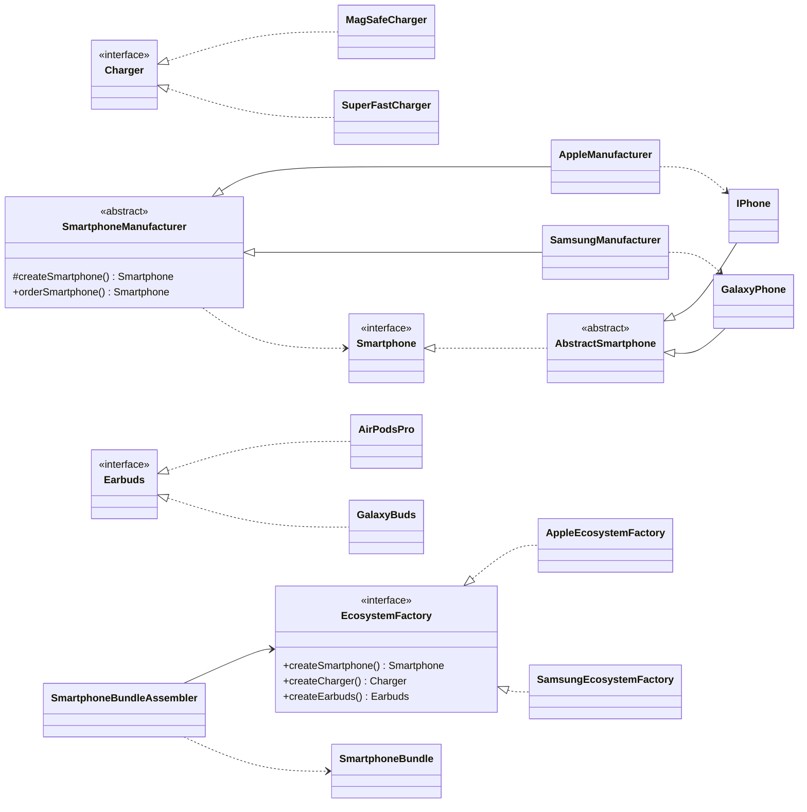

# Smartphone Factories — Factory Method & Abstract Factory

Software Design Patterns, Assignment #2. Domain: **smartphones**.

## Run

```bash
javac -d out $(find src/main/java -name "*.java")
java -cp out smartphones.Main
```

(or `mvn compile` and run `smartphones.Main` from the IDE). Requires JDK 17+.

## Part A — Factory Method

| Role | Class |
| --- | --- |
| Product | `Smartphone` (interface) + `AbstractSmartphone` (shared state and validation) |
| Concrete Products | `IPhone`, `GalaxyPhone` |
| Creator | `SmartphoneManufacturer` — declares `createSmartphone()` and uses it in `orderSmartphone()` |
| Concrete Creators | `AppleManufacturer`, `SamsungManufacturer` |

`orderSmartphone()` is the reason the pattern exists: the ordering flow (create → quality check)
is written once and works with any phone; each subclass only decides *which* phone to create.

## Part B — Abstract Factory

Extends Part A: a brand is no longer just a phone but a whole **family** — phone, charger, earbuds.

| Role | Class |
| --- | --- |
| Abstract Products | `Smartphone`, `Charger`, `Earbuds` |
| Concrete Products (Apple) | `IPhone`, `MagSafeCharger`, `AirPodsPro` |
| Concrete Products (Samsung) | `GalaxyPhone`, `SuperFastCharger`, `GalaxyBuds` |
| Abstract Factory | `EcosystemFactory` |
| Concrete Factories | `AppleEcosystemFactory`, `SamsungEcosystemFactory` |
| Client | `SmartphoneBundleAssembler` (+ `SmartphoneBundle`) — uses only interfaces |

`Main` is the composition root: the only place that chooses a concrete factory.
The client never contains `new IPhone()` or any other concrete class.

## Class diagram



## Clean Code

See [CLEAN_CODE.md](CLEAN_CODE.md) for six applied principles with before/after excerpts.

## Extending

A new brand (e.g. Xiaomi) means adding new classes only — `XiaomiPhone`, `XiaomiManufacturer`,
`XiaomiEcosystemFactory`, etc. Nothing existing has to change (Open/Closed Principle).
A new product type (e.g. a smartwatch) is harder: every factory must get a new method — a known
trade-off of Abstract Factory.
